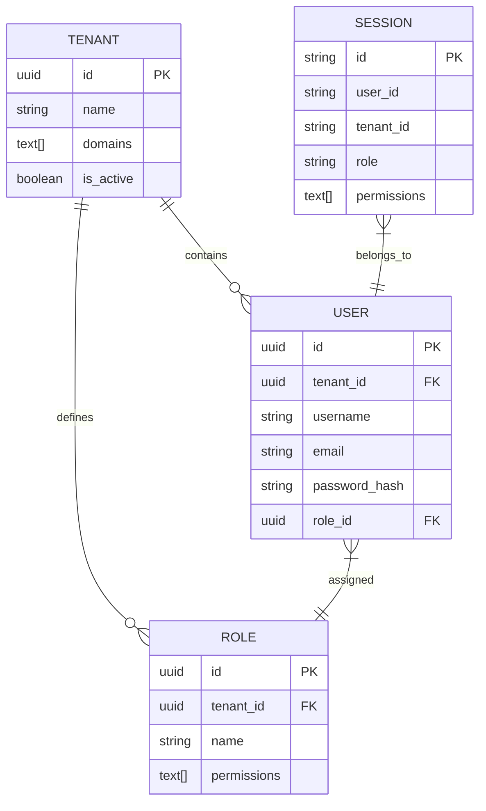

# Multi-Tenant IAM Service

A highly scalable, multi-tenant Identity and Access Management (IAM) service built with Go, adhering to strict Domain-Driven Design (DDD) principles.

## Architecture Overview

The project follows a clean architecture with the following layers:

- **Domain Layer (`domain/`):** Contains pure business logic, entities, value objects, and repository interfaces. No external dependencies.
- **Application Layer (`application/`):** Orchestrates use cases and interacts with domain models and repository interfaces.
- **Infrastructure Layer (`infrastructure/`):** Concrete implementations of repositories (GORM for PostgreSQL, Redis for sessions), configurations, and logging.
- **Interfaces Layer (`interfaces/`):** HTTP handlers, middlewares, and routing using `go-chi`.

## Current State: Phase 2 (Infrastructure Implementation)

In this phase, the infrastructure layer has been implemented, providing concrete data access logic.

### Infrastructure Components

- **GORM Models:** PostgreSQL-specific models with struct tags for `Tenant`, `User`, and `Role`.
- **PostgreSQL Repositories:** Concrete implementations of `domain` interfaces using GORM.
- **Redis Session Repository:** Manages active user sessions in Redis, supporting multiple sessions per user and strict session payloads.
- **Mapping:** Strict separation between pure `domain` entities and `infrastructure` models using mapper functions (`ToDomain` / `FromDomain`).

### Database Schema (Conceptual)



## Directory Structure

```text
.
├── cmd/
│   └── server/
│       └── main.go
├── domain/
│   ├── permission/
│   │   └── value_objects.go
│   ├── role/
│   │   ├── entity.go
│   │   └── repository.go (interface in entity.go)
│   ├── session/
│   │   ├── entity.go
│   │   └── strategy.go (interface in entity.go)
│   ├── tenant/
│   │   ├── entity.go
│   │   └── repository.go (interface in entity.go)
│   └── user/
│       ├── entity.go
│       └── repository.go (interface in entity.go)
├── application/
│   ├── auth/
│   ├── session/
│   ├── tenant/
│   └── user/
├── infrastructure/
│   ├── config/
│   ├── logger/
│   └── persistence/
│       ├── gorm/
│       │   ├── models/
│       │   └── repositories/
│       └── redis/
│           └── repositories/
├── interfaces/
│   └── http/
│       ├── handlers/
│       ├── middleware/
│       └── router.go
└── README.md
```
